#  _Internet Movie Database_ Specification
Design and implement a desktop application for movie management. The application can be accessed by the manager or by employees using a username and a password for authentication. For each user they are stored information.

An regular user:
- See information about movies/ actors/ directors;
- See movies suggestions;
- Create lists/ watchlists (add/ delete movies);
- Edit profile;
- Rating movies;
- See search news;
- Create;
-	Login;
- Sign up;
-	Search by name.

Pro user:
- Can do everything the regular user does;
- See inside informations;
- Review movie;
- Check filmographies & credits;
- Find industry contacts & talent representation;
- Monitor industry trends.

Admin:
-	Login
- See users;
- CRUD employee;
-	Generate emploeyee raports.

Employee:
- CRUD person;
- Login;
- add new movie;
- Update movie informetion;
- add news.

Visitor:
- See and search movie;
- See and search actors/ directors info;
- See and search news.

# Elaboration – Iteration 1.1

## Domain Model
Domain Modeling is a way to describe and model real world entities and the relationships between them, which collectively describe the problem domain space. Derived from an understanding of system-level requirements, identifying domain entities and their relationships provides an effective basis for understanding and helps practitioners design systems for maintainability, testability, and incremental development.The domain model provides a structural view of the system that can be complemented by other dynamic views in Use Case models.

## Architectural Design

### Conceptual Architecture

#### _Model-View-Controller_

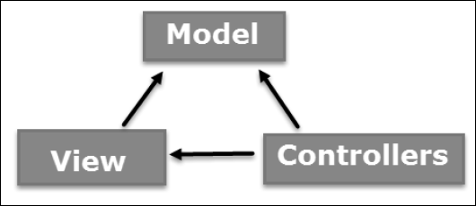

The Model-View-Controller (MVC) is an architectural pattern that separates an application into three main logical components: the model, the view, and the controller. Each of these components are built to handle specific development aspects of an application. MVC is one of the most frequently used industry-standard web development framework to create scalable and extensible projects.

_Model_:

 The Model component corresponds to all the data-related logic that the user works with. This can represent either the data that is being transferred between the View and Controller components or any other business logic-related data. For example, a Customer object will retrieve the customer information from the database, manipulate it and update it data back to the database or use it to render data.

_View_:

 The View component is used for all the UI logic of the application. For example, the Customer view will include all the UI components such as text boxes, dropdowns, etc. that the final user interacts with.

_Controller_:

 Controllers act as an interface between Model and View components to process all the business logic and incoming requests, manipulate data using the Model component and interact with the Views to render the final output. For example, the Customer controller will handle all the interactions and inputs from the Customer View and update the database using the Customer Model. The same controller will be used to view the Customer data.
 By decoupling models and views, MVC helps to reduce the complexity in architectural design and to increase flexibility and reuse of code
 
 

### Package Design

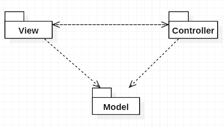

In package Controller is the dao and bl subpackages.

### Component and Deployment Diagrams

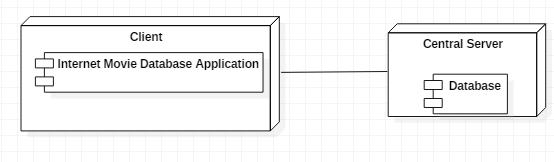

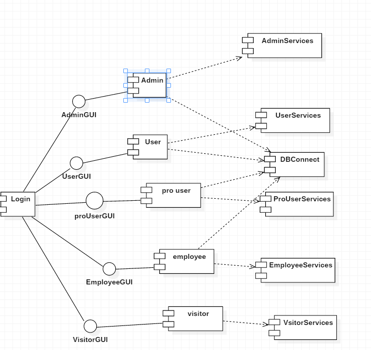

[Create the component and deployment diagrams.]

# Elaboration – Iteration 1.2

## Design Model

### Dynamic Behavior
Interaction diagrams:

_Sequence_:
- Add Movie.
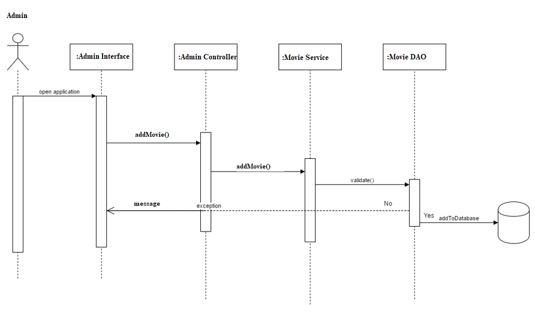

_Communication diagrams_:
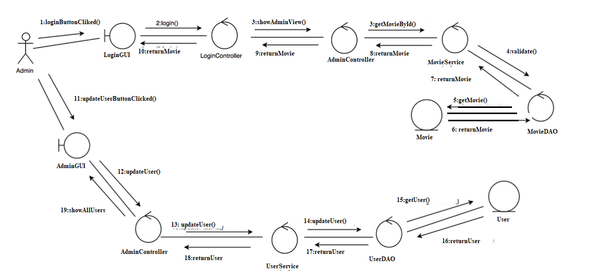

### Class Design
#### Factory Design Pattern: 
The essence of the Factory method Pattern is to "Define an interface for creating an object, but let the subclasses decide which class to instantiate. The Factory method lets a class defer instantiation to subclasses."
The factory design pattern has been applied in order to instantiate the commands based on their message string. In this case, pattern is used for raports namely the admin can choose from a pdf or text report.

#### DAO pattern.
It is used to separate low level data accessing or operations from high level business services. The Data Access Object pattern consists of: an interface defines the standard operations to be performed on a model object, the concrete class which implements it and the model class which contains the get/set methods used to store data retrieved it.

#### Dependency injection
Java Dependency Injection design pattern allows us to remove the hard-coded dependencies and make our application loosely coupled, extendable and maintainable. 
This can also help when unit testing. In this exact case I will be injection the view and the data access in the controller. This way I will be able to unit test the controller.

#### Singleton Pattern
 Singleton pattern can be implemented in Java to provide a single point where all global data can be stored and accessed.

UML class diagram:
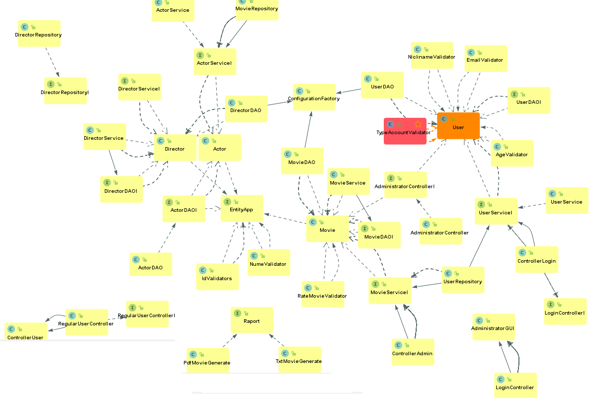

### Data Model
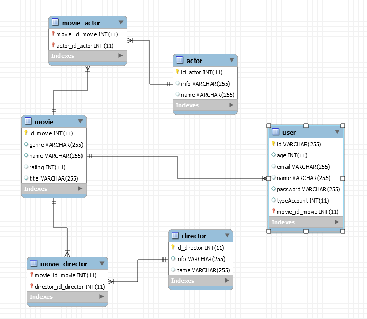

### Unit Testing
A unit test is a piece of code written by a developer that executes a specific functionality in the code to be tested and asserts a certain behavior or state. The percentage of code which is tested by unit tests is typically called test coverage. A unit test targets a small unit of code, e.g., a method or a class. External dependencies should be removed from unit tests, e.g., by replacing the dependency with a test implementation or a (mock) object created by a test framework.An object under test may have dependencies on other (complex) objects. To isolate the behavior of the object one wants to test, it replaces the other objects by mocks that simulate the behavior of the real objects. 
For this tests I used JUnit4 with Mockito.

# Elaboration – Iteration 2

## Architectural Design Refinement
The package design has been lightly modified by putting all the Controller Classes from the presentation package into a sub package named controllers.
The main conceptual architecture has not been altered and remained the same as before. It has been slightly refined visually.

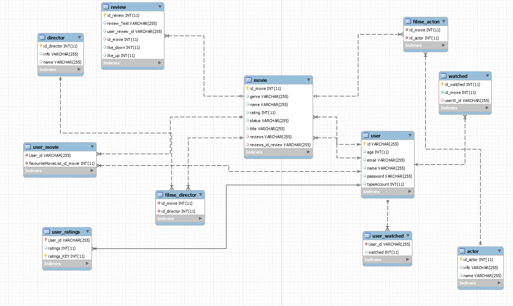
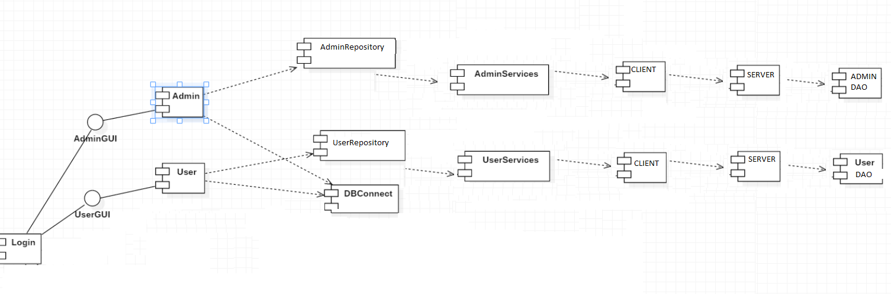
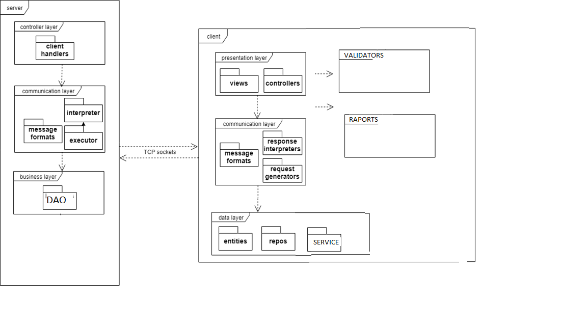
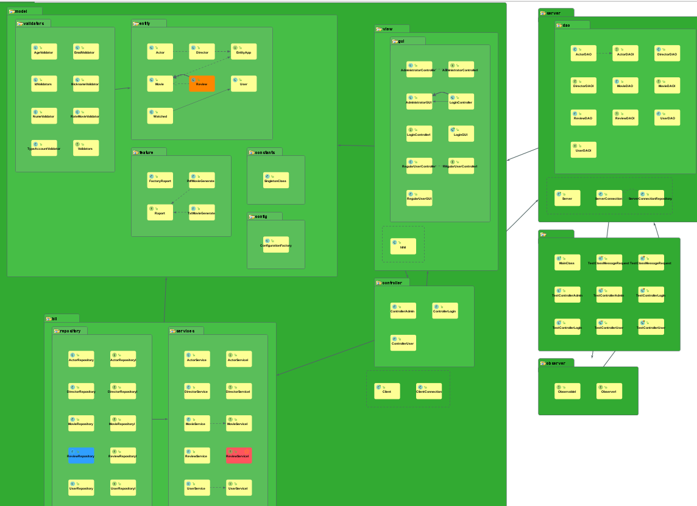
Read user:
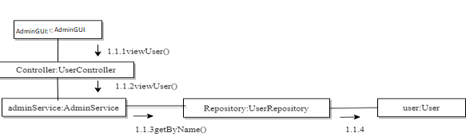

Added multiple layers to to modulate the application based on client server architecture.

## Design Model Refinement
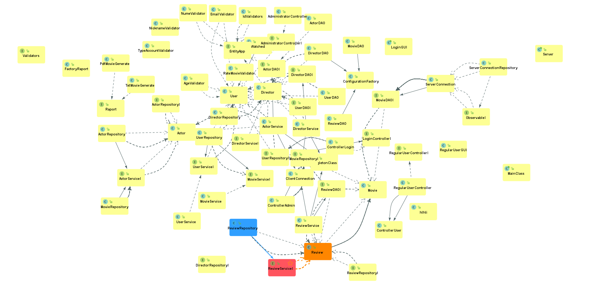

-Observer Design Pattern will be used. This defines a one-to-many dependency between objects so that 	when one object changes state, all its dependents are notified and updated automatically.A specific change in a donor(observable) details will be notified to the patient(observer) waiting for that specific change(i.e. a new donor appears with the needed blood group). 

-Strategy Design Pattern encapsulates an algorithm inside a class, letting the algorithm vary independently from clients that use it. In our situation, it’s necessary to process login event according to the type of user: patient or donor. The donor and patient controller classes will be responsible for encapsulating the ‘algorithm’ of handling the flow following the login confirmation.

# Construction and Transition

## System Testing
In the current state of our product, I have managed to test each component of the business layer, performing the CRUD operations and other functionalities.Different parts of the projects were tested as the implementation was carried. The system has managed to pass all tests.

## Future improvements
As future improvements of the product, if time is given, one could implement a mobile app that performs
the same tasks as the web application.  Also, the application is lacking a registration section and a good looking GUI.Not least, the application can be converted to a Web one and increase securiry using Spring Securiry.

# Bibliography
- [Architectural Styles](https://docs.microsoft.com/en-us/azure/architecture/guide/architecture-styles/)
- [Architectural Patterns and Styles](https://msdn.microsoft.com/en-us/library/ee658117.aspx)
- [Online diagram drawing software](https://yuml.me/) ([Samples](https://yuml.me/diagram/scruffy/class/samples))
- [Yet another online diagram drawing software](https://www.draw.io)
