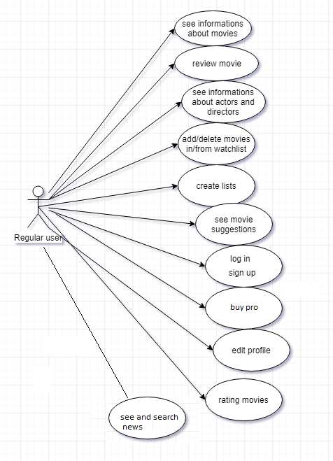
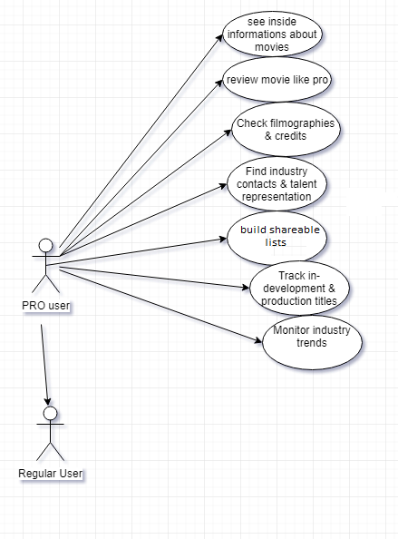
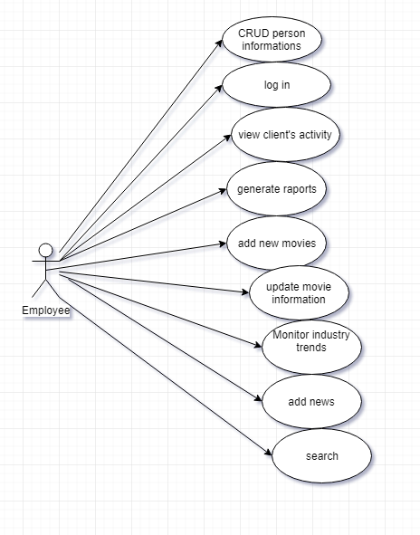
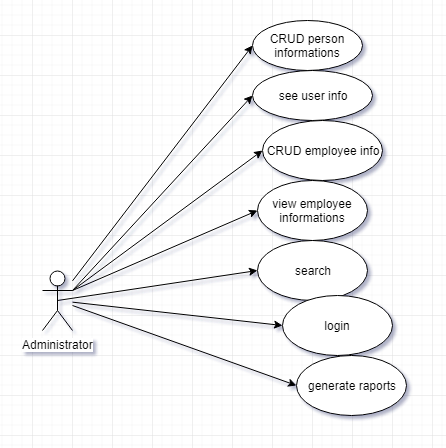
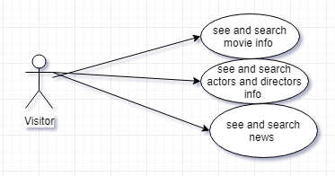

# (Movie Database) Use Case Model

# Use-Cases Identification
[Identify actors, scenarios and use cases. Describe the three most important use-cases according to the following format:

## Use case 1
* **Use case**: CRUD user
* **Level**: user-goal level
* **Primary actor**: administrator
* **Main success scenario**: CRUD the user by his unique id in the text box and press the ok button 
* **Extensions**: if the code is wrong or don't exists then can't CRUD and won't be shown any information 

## Use case 2
* **Use case**: see and search movie info 
* **Level**: user-goal level
* **Primary actor**: visitor
* **Main success scenario**: search for movie news from the app, and they will be displayed in gui after you press ok button
* **Extensions**: if the info  about the subject don't exists then won't be shown any information besides a message : "no results"

## Use case 3
* **Use case**: add/delete movie in/from watchlist
* **Level**: user-goal 
* **Primary actor**: regular user and PRO user
* **Main success scenario**: search the "watchlist" section, press the "watchlist" button  and add/delete movie in/from watchlist by pressing add/delete buttons
* **Extensions**: movie don't exist, won't be shown any information and a message : "no results"

## Use case 4
* **Use case**: create a list
* **Level**: user-goal 
* **Primary actor**: regular user and PRO user
* **Main success scenario**:  press the button "create list", search interests and add these into list
* **Extensions**: interests don't exists or the list is already created (have same name) 

## Use case 18
* **Use case**: buy pro
* **Level**: user-goal 
* **Primary actor**: regular user and PRO user
* **Main success scenario**: payment operation fields successfully completed for more features by pressing "buy pro" button and accept terms
* **Extensions**:  insufficient amount of money 

# UML Use-Case Diagrams
[Create the UML Use-Case Diagrams.]

## Regular User

## PRO User

## Employee

## Administrator

## Visitor 

# Bibliography

* [Online diagram drawing software](https://yuml.me/) ([Samples](https://yuml.me/diagram/nofunky/usecase/samples))
* [Yet another online diagram drawing software](https://www.draw.io)
